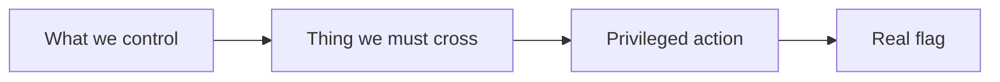

# CTF progress-record template

Copy this structure to `.context/<challenge>-progress.md`. Keep the first five sections at the
top and current throughout the investigation.

````markdown
# <Challenge> — Investigation Record

## Explain it like I just arrived



One sentence: We can control ___, need to cross ___, and win only when ___.

## Win status

**NOT WON**

Success predicate: `<exact observable condition>`

Live target identity: `<unverified | verified by marker>`

Independent verification: `<not run | result>`

## Top findings

- **PROVEN:** ...
- **INFERRED:** ...
- **UNKNOWN:** ...
- **CORRECTION:** ...

## Attempts

| # | One changed variable | Result | What it establishes |
|---|---|---|---|
| 1 | Baseline | ... | ... |

## TODOs, in priority order

1. `[high information / low risk]` ...
2. ...

## Scope and evidence inventory

- Supplied target: ...
- Authorization basis: challenge-provided target/artifact
- Original artifact: `<name, bytes, type, SHA-256>`
- Working copy: ...
- Shared state: `<unknown | isolated | shared>`

## Capability ledger

| State | Capability or unknown | Evidence |
|---|---|---|
| proven | ... | request/packet/source location |
| unknown | ... | next discriminating probe |

## Trust-boundary map

| Attacker-controlled input | Transform/owner | Privileged field or sink | Evidence |
|---|---|---|---|
| ... | ... | ... | ... |

## Evidence log

Record timestamps, exact commands or requests, concise response excerpts, packet/stream IDs,
hashes, and conclusions. Redact only in any version intended for commit.

## Final reproduction

1. ...

## Honest retrospective

- What actually unlocked the win: ...
- What wasted time and why: ...
- Who found the winning path: ...
- Generalized lesson: ...
````

Use `WON — independently verified` only after the live success predicate and second check both
pass. Otherwise retain `NOT WON`, even if a local exploit works or a flag-shaped fixture appears.
